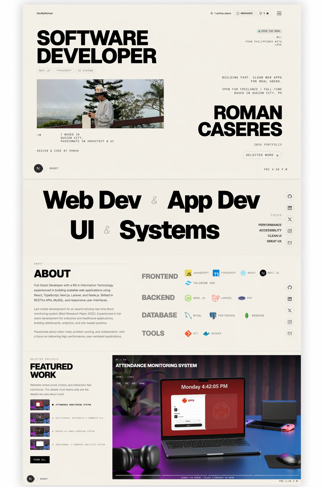

# Rafi Raihan - Developer Portfolio




Modern software developer portfolio built with **Next.js, TypeScript, Tailwind CSS, and Framer Motion**.

## Live Website
[https://#](https://#)

## Features
- Minimal brutalist UI
- Smooth section transitions
- Responsive design
- Selected work showcase
- About and skills sections
- Fast optimized Next.js build

## Tech Stack
- Next.js
- TypeScript
- Tailwind CSS
- Framer Motion
- Vercel

## Preview Sections
- Hero
- Web Dev / UI Systems
- About + Stack
- Featured Work

## Run Locally
```bash
npm install
npm run dev
```

## Contact
- LinkedIn: [https://www.linkedin.com/in/rafiraihann](https://www.linkedin.com/in/rafiraihann)
- GitHub: [https://github.com/rafiiraihan](https://github.com/rafiiraihan)
- Portfolio: [https://#](https://#)